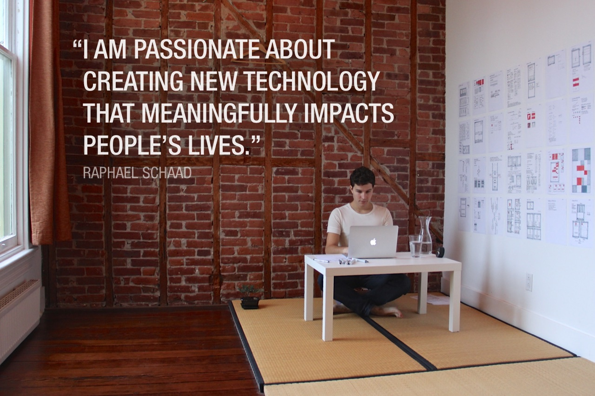

With a background in computer science and design from Switzerland, I developed innovative software in Tokyo and California. My enthusiasm for pushing the boundaries of what’s currently possible drives me to further explore the areas of **data analysis and visualization, new user interfaces and interactions, and mobile social networks**.

Learn more about my education, experience, and select skills & accomplishments in my [Resume (PDF)](downloads/Resume-Raphael-Schaad-2014-12-Education.pdf).
